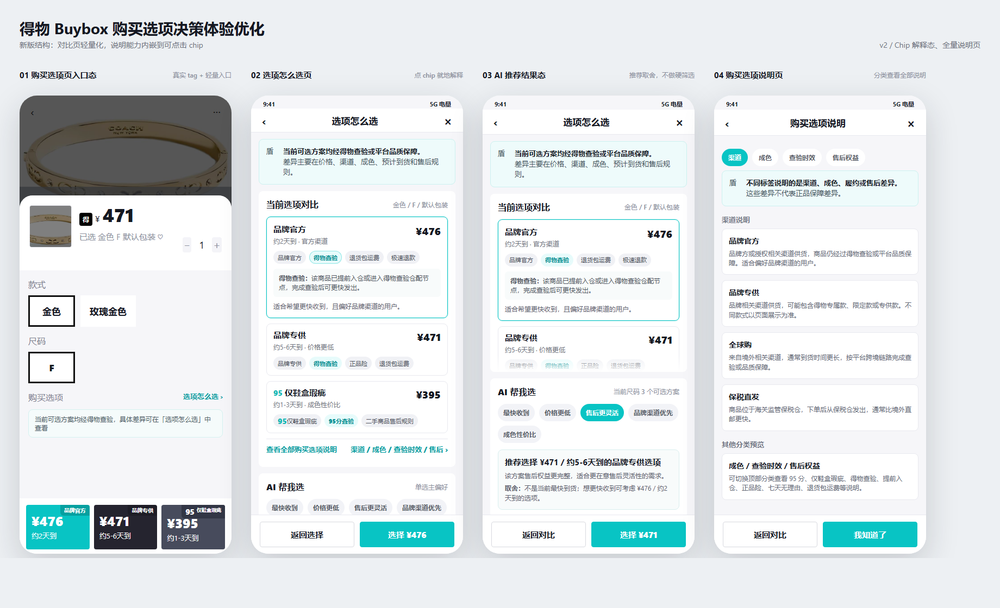

# 得物 Buybox 购买选项决策体验优化

这是一个面向作品集展示的电商产品项目，围绕得物商品详情页中的多购买选项场景，设计「选项怎么选」能力，帮助用户理解不同购买方案在渠道、成色、时效、查验和售后上的差异，降低决策成本。



## 在线查看

- 网页 Demo：[https://SiyuQiannn.github.io/dewu-buybox/](https://SiyuQiannn.github.io/dewu-buybox/)
- PRD 文档：[demo/prd.md](demo/prd.md)
- Demo 源码：[demo/index.html](demo/index.html)
- 原型稿归档：[prototype/](prototype/)

> 如果 Demo 链接暂时打不开，说明 GitHub Pages 还没有在仓库设置中开启。开启后，HR 可以直接从这个链接访问网页。

## 项目背景

得物的多购买选项机制会在同一商品下展示不同价格、渠道、成色和履约时效的购买方案。用户虽然可以看到价格和时效差异，但往往难以理解这些差异背后的原因，容易把渠道、履约和售后差异误读为正品保障差异。

本项目不是重构交易机制，而是优化购买选项页的前台信息表达与决策辅助体验。

## 核心问题

- 购买选项多，但差异来源不清晰。
- 快速到货容易被误解为没有经过查验。
- 渠道、成色、售后信息分散，用户缺少横向对比工具。
- 平台统一保障心智和差异化购买决策之间存在信息表达断层。

## 方案概述

- 增加「选项怎么选」入口，把购买选项差异解释前置。
- 提供横向对比视图，帮助用户比较价格、时效、渠道、成色和售后。
- 引入 AI 辅助推荐，但只作为结构化信息解释和取舍建议，不替代官方规则说明。
- 在确认订单链路补充关键差异提醒，降低售后预期偏差。

## 仓库结构

```text
demo/
  index.html          网页 Demo
  prd.md              PRD 文档
  assets/             Demo 使用的图片素材

prototype/
  *.html              原型页面
  *.png               原型截图与版本归档

README.md             GitHub 项目首页说明
index.html            GitHub Pages 入口跳转页
```

## 版本迭代

- 初版：完成购买选项页问题定义和 PRD。
- 原型迭代：完成入口、对比、AI 推荐、规则解释等核心页面。
- 展示整理：补充 Demo 页面、项目 README 和 GitHub Pages 入口。

